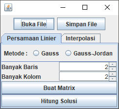
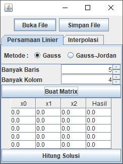
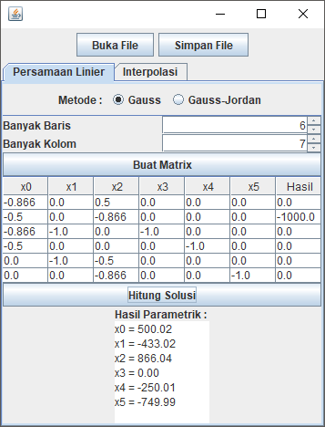
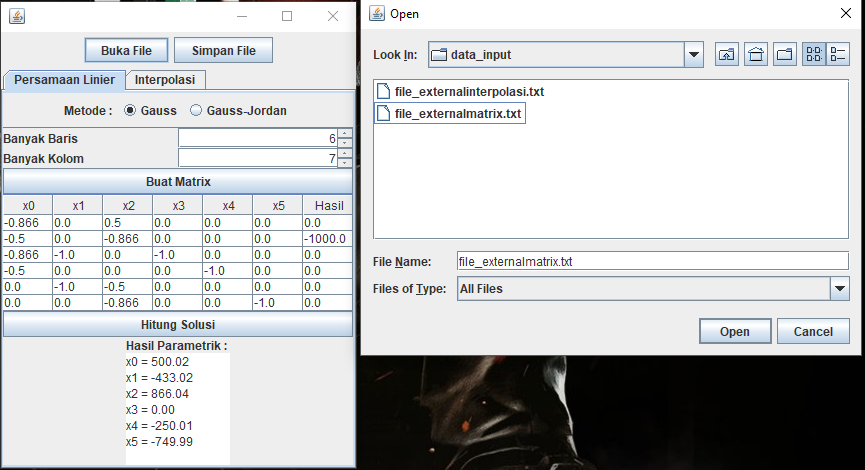
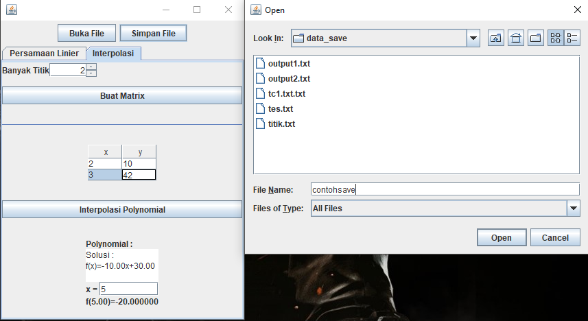
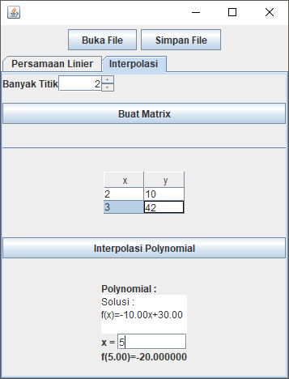

# Aplikasi Gauss dan Interpolasi Polinom

Program ini adalah contoh pengaplikasian metode Gauss dan Gauss-Jordan untuk menyelesaikan masalah sistem persamaan linear dengan n-variabel dan juga interpolasi polinom. 

## Instalasi Program

Program ini dibuat menggunakan bahasa pemrograman java oleh karena itu dibutuhkan compiler Java SE versi 8 atau lebih tinggi. Compiler dapat diunduh melalui https://www.oracle.com/technetwork/java/javase/downloads/jdk8-downloads-2133151.html

Setelah itu, lakukan clone pada repository ini, atau download sebagai .zip kemudian extract ke tempat yang diinginkan.

### Cara Kompilasi Kode Program
Untuk mengompilasi kode program, buka terminal pada komputer dan pergi
ke directory program atau hasil extract tadi. Kemudian, ikuti instruksi di bawah ini :

    C:\Users\<user>\Documents\GitHub\Tubes-Algeo>
    # cd src
    C:\Users\<user>\Documents\GitHub\Tubes-Algeo\src>
    # javac *.java -d ../bin
    

Setelah perintah di atas diketik dan tidak muncul error, maka program berhasil di kompilasi.

### Cara Menjalankan Program

Setelah program dikompilasi, maka program dapat dijalankan. Untuk menjalankan program, pindah ke directory bin dan run programnya. Berikut adalah instruksi untuk menjalankan program :

    C:\Users\<user>\Documents\GitHub\Tubes-Algeo\src>
    # cd ..
    C:\Users\<user>\Documents\GitHub\Tubes-Algeo>
    # cd bin
    C:\Users\<user>\Documents\GitHub\Tubes-Algeo\bin>
    # java src.main
    SPL SOLVER DAN INTERPOLASI POLINOM

    Menu Utama :
    1. Sistem Persamaan Linier
    2. Interpolasi Polinom
    3. GUI
    4. Keluar
Jika program berhasil dijalankan, maka akan muncul menu utama program seperti di atas.

## Cara Menggunakan Program

Ketika program di run, maka menu utama akan muncul. Di menu utama ini terdapat empat pilihan. Ketikkan input yang sesuai dengan nomor yang sesuai (contoh 1 untuk Sistem Persamaan Linier).

Pada bagian potongan-potongan program di bawah, tanda # berarti input dari pengguna. 
### Sistem Persamaan Linier
Dari bagian menu utama, ketikkan 1 untuk masuk ke bagian Sistem Persamaan Linier. Di Sistem Persamaan Linier, anda dapat menyelesaikan persamaan linier dengan 2 metode yang disediakan yaitu Gauss dan Gauss Jordan.

    SPL SOLVER DAN INTERPOLASI POLINOM
    
    Menu Utama :
    1. Sistem Persamaan Linier
    2. Interpolasi Polinom
    3. GUI
    4. Keluar
    # 1
    Pilihan :
    1. Metode Gauss
    2. Metode Gauss Jordan
Perbedaan dari kedua metode ini hanyalah bentuk matriks solusinya. Pada metode Gauss, matriks solusinya berupa echelon form, sedangkan pada metode Gauss-Jordan, matriks solusinya berupa reduced-echelon form.

Setelah anda memilih metode yang ingin digunakan, anda diberikan opsi untuk menyimpan hasil jawaban. Jika anda memilih iya, maka anda harus memasukkan nama file hasil penyimpanan. Perhatikan bahwa nama file tidak perlu diberi extension .txt atau yang lainnya karena file otomatis tersimpan dengan extension.txt. Hasil penyimpanan file akan terdapat di folder data_save (lengkapnya \Tubes-Algeo\test\data_save\).

    Apakah anda ingin menyimpan hasilnya?
    <ya/tidak> :
    # ya
    Masukkan nama file : 
    # contohoutput

Selain menyimpan file, program ini juga dapat mengambil persamaan dari file eksternal. Jika anda ingin melakukan ini, simpan file eksternal anda dengan nama file_externalmatrix.txt di folder data_input (lengkapnya \Tubes-Algeo\test\data_input\) agar program dapat membacanya. 

Jika anda memilih untuk tidak membuka file eksternal, anda akan diminta banyak persamaan, banyak variabel, dan matriks persamaannya. Perhatikan dalam memasukkan matriks persamaan, pastikan anda memasukkan bentuk augmented matriksnya. Untuk lebih jelasnya, simak potongan program berikut :

    Banyak persamaan :
    # 3
    Banyak variable :
    # 3
    Masukkan persamaan :
    # 1 6 5 4
    # 3 5 7 8
    # 6 4 6 5
    Matrix persamaan :
    1.000000 6.000000 5.000000 4.000000
    3.000000 5.000000 7.000000 8.000000
    6.000000 4.000000 6.000000 5.000000
    Matrix hasil Gauss :
    1.000000 6.000000 5.000000 4.000000
    -0.000000 1.000000 0.615385 0.307692
    -0.000000 -0.000000 1.000000 2.125000
    Solusi Persamaan Linier :
    x0 = -0.63
    x1 = -1.00
    x2 = 2.13
Setelah anda memasukkan persamaan, program akan langsung menyelesaikan persamaan tersebut dan memberikan anda solusinya. Program ini juga dapat memberikan persamaan dalam bentuk parametrik.

### Interpolasi Polinom
Pada bagian ini, anda dapat memasukkan sembarang titik (misal (x,y)) sejumlah tertentu. Kemudian program akan mencari fungsi yang dapat memetakan titik-titik tersebut sesuai input anda. Setelah itu, anda juga dapat menginterpolasi atau menaksir nilai fungsi ketika x bernilai tertentu.

Sama halnya dengan Sistem Persamaan Linier, pada bagian ini anda juga dapat menyimpan hasil file dan membuka file eksternal sama seperti penjelasan sebelumnya.

Jika anda memilih untuk tidak membuka file eksternal, anda harus memasukkan banyak titik dan titik-titik tersebut. Berikut adalah contoh potongan programnya :

    Masukkan banyak titik :
    # 5
    Masukkan titik-titik :
    # 1 3
    # 2 6
    # 3 7
    # 4 9
    # 5 12
    Solusi :
    f(x)=-0.13x^4+1.75x^3-8.38x^2+17.75x-8.00
    
    Masukkan nilai x yang akan diinterpolasi : 
    # 7.2
    f(7.20)=2.900800

### GUI atau Graphical User Interface
Selain menjalankan file dari terminal, program ini juga dilengkapi dengan GUI interaktif sehingga anda lebih mudah menggunakannya. Untuk membuka GUI, dari menu utama ketikkan 3. 
 
Maka GUI akan tampak seperti gambar di atas. Di GUI, anda dapat memilih apakah ingin menyelesaikan persamaan linier atau interpolasi polinom. 
 
Jika anda ingin menyelesaikan persamaan linier, maka pilih metodenya, masukkan banyak baris dan kolom, kemudian tekan tombol Buat Matrix. Setelah itu ketikkan persamaan dan tekan tombol Hitung Solusi. 
 
Selain dengan mengetikkan persamaan, anda juga bisa membuka persamaan dari file eksternal dengan menekan tombol Buka File. Cari file dan pilih Open. 
 
Solusi persamaan akan muncul. Anda dapat menyimpan solusi persamaan ini dengan menekan tombol Simpan File. Kemudian pilih tempat penyimpanan dan pilih Save. 
 
Untuk interpolasi polinom, dengan cara yang sama anda perlu memasukkan banyak titik kemudian tekan tombol Buat Matrix. Setelah itu masukkan titik-titik yang akan diinterpolasi. 
 
Terakhir, tekan tombol Interpolasi Polynomial untuk menghitung solusi. Anda juga dapat menginterpolasi titik sembarang dengan memasukkan ke kotak yang disediakan.
## Kontributor
Program dibuat untuk memenuhi salah satu Tugas Besar IF2123 Aljabar Geometri Teknik Informatika ITB. Adapun pembuat dari program ini adalah :

 - Aditya Putra Santosa - 13517013
 - Steve Andreas Immanuel - 13517039
 - Ahmad Rizal Alifio - 13517076
